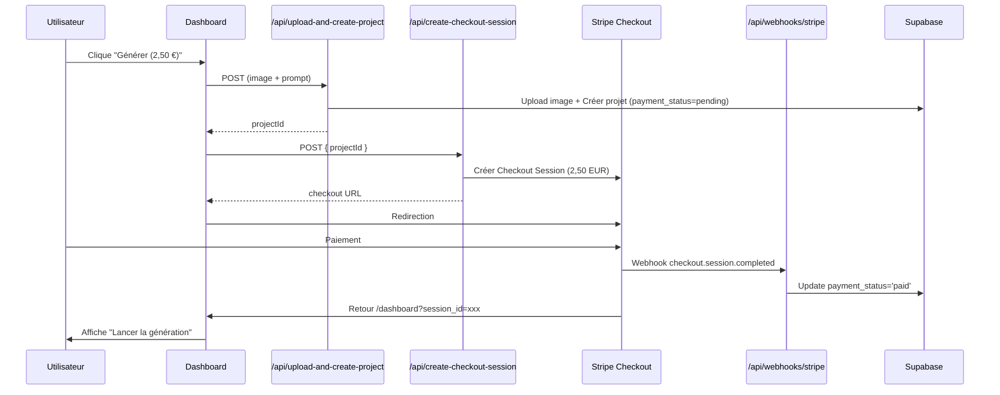
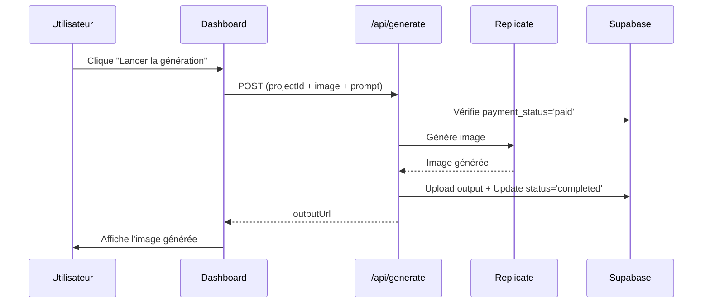

# 🎨 Flow de Paiement Stripe - Génération d'Images IA

## 📋 Résumé

Votre projet Next.js est maintenant configuré avec **Stripe** pour un modèle de **paiement à la génération** (2,50 EUR par image générée).

## 🔄 Flow Complet

### Phase 1 : Paiement



### Phase 2 : Génération



## 📁 Fichiers Créés/Modifiés

### ✅ Nouveaux fichiers

1. **`src/lib/stripe-client.ts`**
   - Helper pour initialiser Stripe côté client

2. **`src/app/api/create-checkout-session/route.ts`**
   - Crée une session Stripe Checkout
   - Montant hardcodé : 250 centimes (2,50 EUR)

3. **`src/app/api/webhooks/stripe/route.ts`**
   - Reçoit les webhooks Stripe
   - **Vérifie la signature** avec `stripe.webhooks.constructEvent()`
   - Met à jour `payment_status='paid'`

4. **`src/app/api/upload-and-create-project/route.ts`**
   - Upload l'image dans Supabase Storage
   - Crée un projet avec `payment_status='pending'`

5. **`STRIPE_SETUP.md`**
   - Documentation complète de la configuration Stripe

### 🔧 Fichiers modifiés

1. **`.env.local`**
   - Ajout des clés Stripe (publishable, secret)
   - `NEXT_PUBLIC_URL` pour les redirections

2. **`src/app/api/generate/route.ts`**
   - Vérifie `payment_status='paid'` avant génération
   - Accepte un `projectId` dans le FormData
   - Met à jour le projet après génération

3. **`src/app/dashboard/DashboardClient.tsx`**
   - Bouton "Générer (2,50 €)" → redirige vers Stripe
   - Affiche "Lancer la génération" après paiement
   - Gère le retour de Stripe avec `session_id`

4. **`src/app/dashboard/page.tsx`**
   - Récupère aussi le champ `payment_status`

5. **`src/app/api/projects/[id]/route.ts`**
   - Ajout de la méthode `GET` pour récupérer un projet

## 🔐 Sécurité Implémentée

### ✅ Vérification de la signature webhook

```typescript
const event = stripe.webhooks.constructEvent(body, signature, webhookSecret);
```

Sans cette vérification, n'importe qui pourrait envoyer un faux webhook !

### ✅ Vérification du paiement avant génération

```typescript
if (project.payment_status !== 'paid') {
  return NextResponse.json({ error: 'Paiement requis' }, { status: 402 });
}
```

### ✅ Vérification de propriété

```typescript
if (project.user_id !== user.id) {
  return NextResponse.json({ error: 'Non autorisé' }, { status: 403 });
}
```

### ✅ Montant hardcodé côté serveur

Le montant de 2,50 EUR est **toujours** défini côté serveur, jamais envoyé par le client.

## 🚀 Prochaines Étapes

### 1. Configurer le webhook Stripe

```bash
# En local avec Stripe CLI
stripe listen --forward-to localhost:3000/api/webhooks/stripe
```

Copiez le webhook secret (`whsec_...`) dans `.env.local` :

```bash
STRIPE_WEBHOOK_SECRET=whsec_xxxxxxxxxxxxx
```

### 2. Tester le flow

1. Lancez le serveur :
   ```bash
   npm run dev
   ```

2. Allez sur `/dashboard`

3. Uploadez une image et entrez un prompt

4. Cliquez sur "Générer (2,50 €)"

5. Sur la page Stripe Checkout, utilisez la carte de test :
   - Numéro : `4242 4242 4242 4242`
   - Date : n'importe quelle date future
   - CVC : `123`

6. Après paiement, vous serez redirigé vers `/dashboard`

7. Cliquez sur "Lancer la génération"

8. L'image sera générée ! ✨

### 3. Surveiller les webhooks

Dans un terminal séparé :
```bash
stripe listen --forward-to localhost:3000/api/webhooks/stripe
```

Vous verrez tous les événements webhook en temps réel.

### 4. Production

Pour la production, créez un webhook dans [Stripe Dashboard](https://dashboard.stripe.com/webhooks) :

- URL : `https://votre-domaine.com/api/webhooks/stripe`
- Événement : `checkout.session.completed`

Puis mettez à jour `.env.local` avec le **vrai** webhook secret de production.

## 📊 Schéma de la Base de Données

Les champs ajoutés à la table `projects` :

| Champ                      | Type    | Description                                    |
|----------------------------|---------|------------------------------------------------|
| `payment_status`           | text    | `'pending'` ou `'paid'`                        |
| `payment_amount`           | numeric | Montant payé (2.50)                            |
| `stripe_payment_intent_id` | text    | ID du Payment Intent Stripe                    |
| `stripe_checkout_session_id` | text  | ID de la session Stripe Checkout               |

## 🎯 Flux Utilisateur Final

1. **Création du projet** → Upload image + prompt → Projet créé avec `payment_status='pending'`
2. **Paiement** → Redirection vers Stripe → Paiement → Webhook met à jour `payment_status='paid'`
3. **Retour** → Dashboard affiche "Lancer la génération"
4. **Génération** → Vérification du paiement → Génération de l'image → Affichage du résultat

## ❓ Questions Fréquentes

### Pourquoi deux étapes (paiement puis génération) ?

Pour éviter de gaspiller des crédits Replicate si le paiement échoue. On vérifie d'abord que l'utilisateur a payé avant de consommer des ressources.

### Que se passe-t-il si l'utilisateur ferme la page avant de lancer la génération ?

Le projet reste en base avec `payment_status='paid'`. L'utilisateur peut revenir plus tard et lancer la génération.

### Comment rembourser un utilisateur ?

Dans le [Stripe Dashboard](https://dashboard.stripe.com/payments), trouvez le paiement et cliquez sur "Refund".

### Puis-je changer le prix ?

Oui, modifiez la valeur dans `/api/create-checkout-session/route.ts` :

```typescript
unit_amount: 250, // 2,50 EUR → changez cette valeur
```

Et aussi dans `/api/upload-and-create-project/route.ts` :

```typescript
payment_amount: 2.50, // Changez ici aussi
```

## 🎉 C'est prêt !

Votre système de paiement Stripe est maintenant opérationnel. Bon développement ! 🚀
